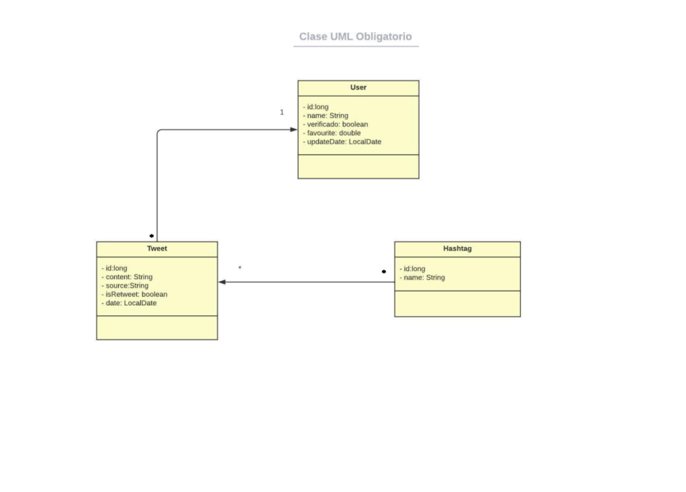
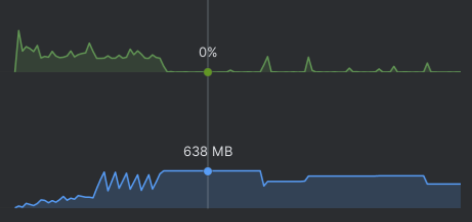

# grupo4-p2-analisis

Entrega 25/06/2023

## Equipo:

- Del Baglivi Juan
- Carballido Bruno

## Carga de archivos

Para la carga de archivos se debe crear una carpeta de nombre 'obligatorio2023' al mismo nivel que 'src' y 'test', y colocar dentro de esta los archivos f1_dataset.csv y drivers.txt

## Descripción de la tarea

Para este trabajo, se solicitó la creación de una aplicación en Java SE que permitiese la
carga de archivos CSV con datos de Tweets y pilotos de fórmula 1, para luego analizarlos
en diversas funciones, buscando optimizar lo máximo posible tiempos y memoria utilizados.

## Descripción de la solución

### Carga inicial de datos

Para el almacenaje en memoria de los Usuarios, Tweets y Hashtags se utilizaron las clases
representadas en el diagrama UML.

La carga inicial de datos ocurre al ejecutar la aplicación, en este proceso se leen los
archivos csv y se itera línea por línea leyendo su contenido.El objetivo principal es extraer
los datos relevantes de cada línea del archivo y almacenarlos en estructuras de datos
adecuadas para su posterior procesamiento y análisis.

El primer archivo en ser cargado es el que contiene la información de los pilotos.
Estos datos son guardados en una lista de tamaño fijo y quedan disponibles para su
posterior uso.

El siguiente archivo en ser leído es el que contiene los Tweets a analizar.
Al leerse la primera línea del archivo se obtiene la cantidad de columnas de este y con ese
dato se procede a leer el resto, parseando los datos por las ‘,’ y verificando que todas las
columnas están presentes, de no ser así se lee la siguiente línea y se concatena con la
actual para lograr corregir aquellas filas que contienen saltos de línea en ellas.
Adicionalmente, se chequea el largo del primer campo para evitar procesar datos
incompletos.

Con estos datos se itera fila a fila, cargando las entidades antes descritas y almacenando
estas en memoria:

*Hash<String, User> usuarios;*\
*LinkedListImpl<User> usuariosLista;*\
*LinkedList<Tweet> tweets;*\
*Hash<String, Hashtag> hashtags;*\
*LinkedList<String> hashtagsLista;*

### Funciones

Una vez cargados todos los datos se inicia el menú desde el cual se disparan el resto de
funciones:

- *Listar los 10 pilotos activos en la temporada 2023 más mencionados en los tweets
en un mes (este mes será ingresado como 2 parámetros separados, mes y año, por
consola). Este listado debe incluir el nombre de los pilotos y la cantidad de
ocurrencias para cada uno de manera ordenada. Se espera que esta operación sea
de orden n en notación Big O.*

Para esta función se itera sobre la lista completa de Tweets y se chequea en cada uno que
el contenido del mensaje contenga nombre o apellido de alguno de los pilotos ingresados.
Estas menciones encontradas son guardadas en un Hash y posteriormente se aplica Bubble
Sort sobre este para obtener los primeros 10 pilotos con más menciones.

- *Top 15 usuarios con más tweets. Este listado debe incluir el nombre de usuario, la
cantidad de tweets, y si el usuario está verificado o no, ordenado por cantidad de
tweets en orden descendente. Se espera que esta operación sea de orden n en
notación Big O.*

En esta función se itera sobre la lista de Tweets y se guarda en un Hash los usuarios y su
cantidad de Tweets realizados, actualizando esta cantidad cada vez que una nueva
ocurrencia surge.
Finalmente, se aplica Bubble Sort sobre este Hash para obtener los primeros 15 usuarios
con más Tweets.

- *Cantidad de hashtags distintos para un día dado. El día será ingresado en el formato
YYYY-MM-DD.*

En esta función se reciben los datos de año, mes y día ingresados por usuario para la
búsqueda y se los pasa a formato LocalDate. Posteriormente, se itera sobre la lista de
Hashtags y dentro de esto se itera sobre la lista de Tweets para cada uno, en caso de
encontrarse al menos un 1 Tweet para la fecha dada se lo suma el Hashtag a la lista de
hashtags para ese día (en caso de que ya no esté) y al final de la función se cuenta el total
obtenido.

- *Hashtag más usado para un día dado, sin tener en cuenta #f1. El día será ingresado
en el formato YYYY-MM-DD.*

Para esta función se reciben los datos de año, mes y día ingresados por usuario para la
búsqueda y se los pasa a formato LocalDate. Posteriormente, se itera sobre la lista de
Hashtags y dentro de esto se itera sobre la lista de Tweets para cada uno, si la fecha del
Tweets coincide con la fecha provista por el usuario, se contabiliza y en caso de que el
hashtag actual tenga mayor cantidad de Tweets que los anteriores, se guardan estos
nuevos valores y se itera hasta llegar al final.

- *Top 7 cuentas con más favoritos. Para este listado se deberá retornar el nombre del
usuario, junto con la cantidad de favoritos.*

En esta función se aplica un Bubble Sort directamente sobre la lista de usuarios, filtrando
así los 7 usuarios con mayor cantidad de Tweets y retornando esta lista.

- *Cantidad de tweets con una palabra o frase específicas (que será ingresado como
parámetro).*

Para la función final se recibe por parámetros una cadena de caracteres a buscar que ha
ingresado el usuario. Con este dato se recorre la lista de Tweets comando, la cantidad de
veces que un Tweet contiene esta misma palabra o frase.

## Rendimiento

### Cantidad de Memoria consumida

En el momento que el programa consume mayor cantidad de memoria durante la carga
inicial de datos, donde llega a alcanzar como pico 638 MB de RAM, pasado este punto y
ejecutar todas las funciones solicitadas nunca se vuelva a exceder este valor.

A continuación (ver pdf) se muestra la gráfica obtenida de IntelliJ Profiler con el uso de CPU y RAM a
lo largo de la ejecución de todo el programa, incluyendo la ejecución de todas las funciones
tomando como fechas 2021-12 o 2021-12-12 según la función solicite la fecha.

### Tiempo de ejecución promedio

Estas pruebas fueron realizadas en una PC con Intel Core i5-10210U, con 8Gb de RAM y
Fedora como sistema operativo y ejecutadas sobre el archivo de Tweets completo.
Todos los tiempos a continuación son tiempos promedios ejecutados con las fechas
detalladas:

Tiempo de carga inicial: 36 segundos\
Función 1 (2021-12): 900 ms\
Función 2: 1000 ms\
Función 3 (2021-12-12): 85 ms\
Función 4 (2021-12-12): 110 ms\
Función 5: 35 ms\
Función 6 (redbull): 330 ms

## Repositorios

Primera entrega (6/6/2023):
https://github.com/jdelbaglivi/grupo4-p2-tads

Segunda entrega (25/6/2023):
https://github.com/Bruno-Carballido/grupo4-p2-analisis